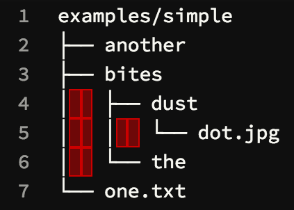

# Tree

> Tree is a recursive directory listing command that produces a depth indented listing of files

This assignment is to re-create the [`tree`](http://mama.indstate.edu/users/ice/tree/) command, using Python.

## Functionality

To play around with the actual `tree` command, you will need to install it within your [virtual machine](https://github.com/startup-systems/vm):

```bash
sudo apt update
sudo apt install tree
```

While the actual `tree` command accepts a bunch of optional flags/options, we are only going to worry about the basic use cases:

* Passing in a path as the first/only argument

    ```
    $ tree examples/simple/
    examples/simple/
    ├── another
    ├── bites
    │   ├── dust
    │   │   └── dot.jpg
    │   └── the
    └── one.txt

    2 directories, 4 files
    ```

* Not passing in any arguments, which will display the contents of the working directory

    ```
    $ cd examples/simple/
    $ tree
    .
    ├── another
    ├── bites
    │   ├── dust
    │   │   └── dot.jpg
    │   └── the
    └── one.txt

    2 directories, 4 files
    ```

Your script should produce identical output, but run with

```bash
./pytree.py [path]
# which is equivalent to
python3 pytree.py [path]
```

## Requirements

* Put your code into [`pytree.py`](pytree.py)
* `pytest` tests passing (**90%** total)
* Code Climate checks passing (**10%**)
* All of the logic must exist in Python. In other words, you may not use any of the following modules/functions:
    * `os.popen()`
    * `os.spawn*()`
    * `os.system()`
    * `subprocess`

## Dealing with unicode

`tree` uses some [unicode](https://www.w3.org/International/questions/qa-what-is-encoding) characters to create the layout and draw the lines. This includes [non-breaking spaces](https://en.wikipedia.org/wiki/Non-breaking_space) (tested with `tree` v1.7.0), highlighted below:



Working with unicode/encodings can be challenging, but in short, we recommend copying-and-pasting the special characters directly from the `tree` output in your terminal to strings in your Python script.

* [More information about unicode in Python](https://docs.python.org/3/howto/unicode.html#the-string-type)
* [A useful site for looking up unicode values](http://unicodelookup.com/)
    * You can paste unicode characters directly in the search box to learn their corresponding name and values

## Running tests locally

Run the following from this directory:

```bash
# install dependencies
sudo apt update
sudo apt install tree
pip3 install -r requirements.txt
# run the pytests
pytest -v
# run the pep8 checks
pep8
```

### Code Climate checks

If you want to try running these locally:

1. [Install Docker](https://docs.docker.com/engine/installation/linux/ubuntulinux/) (follow the "Ubuntu Xenial 16.04 (LTS)" instructions)
1. Run the [Code Climate CLI](https://github.com/codeclimate/codeclimate#readme).

Note that **this is advanced**, so don't worry if you have trouble getting it running.
